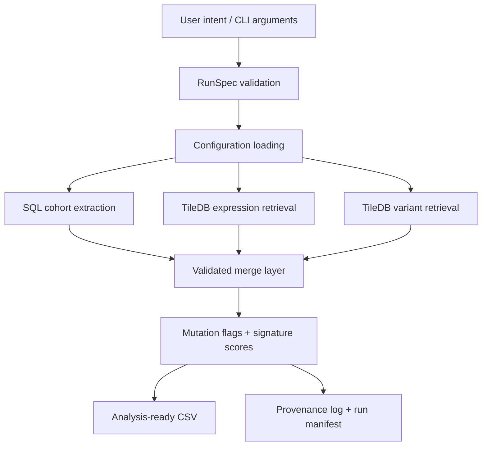

# OncoBridge — Clinical ↔ Genomics Cohort Integration SDK

OncoBridge is a modular Python toolkit for building analysis-ready biomedical datasets by integrating:

- clinical cohort metadata from SQL-backed EHR-style tables,
- gene expression matrices from TileDB arrays, and
- variant calls from TileDB arrays.

The project demonstrates how translational bioinformatics workflows can be engineered as reproducible, validated data pipelines rather than one-off analysis scripts.

The core SDK is disease-agnostic. This repository includes small cell lung cancer (SCLC) as a worked example, but the same pipeline pattern can be adapted to other diseases by providing custom cohort filters, gene-signature definitions, and regimen-bucket definitions.

> **Not for clinical use:** This repository is for research, demonstration, and engineering workflows only. It is not a medical device, diagnostic system, or clinical decision support tool.

---

## What the pipeline builds

The SDK constructs an analysis-ready patient/sample-level dataset through the following stages:

1. Clinical cohort extraction from SQL.
2. Gene-expression retrieval from TileDB.
3. Variant retrieval from TileDB.
4. Clinical/genomic merge and feature assembly.
5. Mutation-presence summarization.
6. Gene-signature scoring.
7. Output dataset creation with provenance logging.



---

## Key features

### Three execution modes

| Mode | Backends | Purpose |
|---|---|---|
| Demo mode | Fully synthetic in-memory data | Zero-setup onboarding and smoke testing |
| Mock infrastructure mode | SQLite + local TileDB | Local validation of SQL/TileDB execution paths |
| Real infrastructure mode | External SQL database + TileDB arrays | Deployment pattern for real research infrastructure |

Demo and mock-infrastructure modes run locally without external credentials.

### Contract-driven configuration

The repository uses Pydantic and Pandera validation for:

- application configuration,
- CLI run specifications,
- input CSV schemas,
- cohort/run manifests, and
- pipeline data contracts.

This helps catch malformed configs, invalid input files, duplicate join keys, unsafe table names, and schema drift before downstream analysis.

### Provenance and run manifests

Each run can write:

- a detailed JSONL provenance log at `run_logs/provenance.jsonl`, and
- a concise run manifest under `run_logs/manifests/`.

Logged information includes query metadata, TileDB access specs, dataframe schema summaries, hashes, output paths, and environment metadata. Sensitive values are redacted or summarized rather than stored verbatim.

### Modular package layout

| Component | Module |
|---|---|
| CLI orchestration | `ehr_fhir_genomics_toolkit/cli.py` |
| Config loading | `ehr_fhir_genomics_toolkit/config.py` |
| Runtime models/contracts | `ehr_fhir_genomics_toolkit/models.py` |
| SQL extraction | `ehr_fhir_genomics_toolkit/sql_connector.py` |
| Expression retrieval | `ehr_fhir_genomics_toolkit/tiledb_expression.py` |
| Variant retrieval | `ehr_fhir_genomics_toolkit/tiledb_variants.py` |
| Dataset assembly | `ehr_fhir_genomics_toolkit/merger.py` |
| Signature scoring | `ehr_fhir_genomics_toolkit/signatures.py` |
| Therapy/regimen logic | `ehr_fhir_genomics_toolkit/therapy_buckets.py` |
| Provenance logging | `ehr_fhir_genomics_toolkit/provenance.py` |
| Run manifests | `ehr_fhir_genomics_toolkit/run_manifest.py` |
| Data contracts | `ehr_fhir_genomics_toolkit/data_contracts.py` |

---

## Installation

Recommended Python version: **Python 3.11**.

### Option 1: editable install

```bash
python -m pip install --upgrade pip setuptools wheel
python -m pip install -e ".[dev]"
```

### Option 2: conda environment

If using the included conda environment file:

```bash
conda env create -f environment.yml
conda activate ehr_genomics_env
python -m pip install -e ".[dev]"
```

The package also exposes a console entry point:

```bash
ehr-fhir-genomics-toolkit --help
```

Equivalent module invocation:

```bash
python -m ehr_fhir_genomics_toolkit.cli --help
```

---

## Quickstart

### 1. Demo mode

Generic synthetic demo:

```bash
python -m ehr_fhir_genomics_toolkit.cli \
  --demo-mode \
  --compute-signatures \
  --include-variants \
  --output demo_dataset.csv
```

SCLC-specific synthetic demo:

```bash
python -m ehr_fhir_genomics_toolkit.cli \
  --demo-mode \
  --diagnosis "small cell lung cancer" \
  --signature-profile sclc \
  --regimen-profile sclc \
  --compute-signatures \
  --include-variants \
  --output demo_sclc_dataset.csv
```

Expected outputs:

- `demo_dataset.csv` or `demo_sclc_dataset.csv`
- `run_logs/provenance.jsonl`
- optional manifest files under `run_logs/manifests/`

### 2. Mock infrastructure mode

Mock mode uses local SQLite plus local TileDB arrays.

Generate local mock assets:

```bash
python scripts/make_mock_data.py
```

This creates generated local assets under:

- `data/mock_ehr.sqlite`
- `data/tiledb/expression_array`
- `data/tiledb/variants_array`

These generated files are intentionally ignored by Git.

Run generic mock infrastructure mode:

```bash
python -m ehr_fhir_genomics_toolkit.cli \
  --config config.mock.yaml \
  --therapy-mode join_table \
  --compute-signatures \
  --include-variants \
  --output mockinfra_dataset.csv
```

Run SCLC mock infrastructure mode:

```bash
python -m ehr_fhir_genomics_toolkit.cli \
  --config config.mock.yaml \
  --diagnosis "small cell lung cancer" \
  --therapy-mode join_table \
  --signature-profile sclc \
  --regimen-profile sclc \
  --regimen-bucket first_line_platinum_etoposide_io \
  --compute-signatures \
  --include-variants \
  --output mockinfra_sclc_dataset.csv
```

---

## Real infrastructure mode

The real infrastructure path uses the same SDK and CLI logic as demo and mock mode, but points the configuration at external SQL and TileDB resources.

Validation status:

- Demo mode has been validated locally.
- Mock infrastructure mode has been validated locally against SQLite + local TileDB.
- Real infrastructure mode is documented as the expected deployment pattern for environments that provide compatible SQL tables and TileDB arrays.
- A public end-to-end run against external/private database infrastructure is not included in this repository.

### Safe configuration pattern

Do not commit real database credentials or private TileDB tokens.

Prefer environment variables:

```bash
export SQLALCHEMY_URL="<database connection string>"
export TILEDB_EXPRESSION_URI="<expression TileDB URI>"
export TILEDB_VARIANTS_URI="<variant TileDB URI>"
export PROVENANCE_LOG_DIR="run_logs"
```

Use local config files such as `config.local.yaml`, `config.real.yaml`, or `config.private.yaml` for private runs. These names should remain ignored by Git.

### Example real-infrastructure run

```bash
python -m ehr_fhir_genomics_toolkit.cli \
  --config config.yaml \
  --diagnosis "disease of interest" \
  --min-age 18 \
  --start-date 2018-01-01 \
  --end-date 2020-12-31 \
  --compute-signatures \
  --include-variants \
  --output merged_dataset.csv
```

SCLC-style real-infrastructure run:

```bash
python -m ehr_fhir_genomics_toolkit.cli \
  --config config.yaml \
  --diagnosis "small cell lung cancer" \
  --therapy-mode join_table \
  --signature-profile sclc \
  --regimen-profile sclc \
  --regimen-bucket first_line_platinum_etoposide_io \
  --compute-signatures \
  --include-variants \
  --output sclc_dataset.csv
```

---

## Therapy filtering and regimen buckets

The SDK supports optional therapy-aware cohort construction.

Relevant CLI arguments:

- `--therapy-mode`
- `--regimen-profile`
- `--regimen-config`
- `--regimen-bucket`

### `therapy_mode`

`therapy_mode=none`

- Therapy data is ignored.
- Cohort selection uses diagnosis, age, collection date, and any DSL filters.

```bash
python -m ehr_fhir_genomics_toolkit.cli \
  --demo-mode \
  --therapy-mode none \
  --compute-signatures
```

`therapy_mode=join_table`

- Therapy data is included in cohort construction.
- In mock/real mode, this joins the configured therapy table.
- In demo mode, synthetic therapy records are generated.

```bash
python -m ehr_fhir_genomics_toolkit.cli \
  --demo-mode \
  --therapy-mode join_table \
  --compute-signatures
```

### Regimen buckets

A regimen bucket is a logical treatment category, for example:

- `any`
- `first_line_platinum_etoposide`
- `first_line_platinum_etoposide_io`
- `second_line`

If you want to include therapy data but not restrict by regimen, use:

```bash
--regimen-bucket any
```

Built-in profiles:

```bash
--regimen-profile generic_oncology
--regimen-profile sclc
```

Custom regimen definition:

```bash
--regimen-config configs/regimen_buckets/my_disease.yaml
```

Example YAML:

```yaml
any: {}

first_line_targeted:
  include_any:
    - osimertinib
    - erlotinib
  line_of_therapy: 1

second_line_chemo:
  include_any:
    - docetaxel
    - gemcitabine
```

---

## Cohort query DSL

The CLI supports a lightweight disease-agnostic cohort DSL.

Examples:

```text
diagnosis=breast cancer; min_age=18; start_date=2019-01-01; end_date=2021-12-31
```

```text
diagnosis=small cell lung cancer; min_age=18; start_date=2018-01-01; end_date=2020-12-31; therapy_mode=join_table; regimen_bucket=first_line_platinum_etoposide_io
```

Example run:

```bash
python -m ehr_fhir_genomics_toolkit.cli \
  --config config.mock.yaml \
  --cohort-dsl "diagnosis=small cell lung cancer; min_age=18; start_date=2018-01-01; end_date=2020-12-31; therapy_mode=join_table; regimen_bucket=first_line_platinum_etoposide_io" \
  --signature-profile sclc \
  --regimen-profile sclc \
  --compute-signatures \
  --include-variants \
  --output dsl_dataset.csv
```

The DSL overrides regular cohort CLI flags.

---

## Bring-your-own data

The core SDK is disease-agnostic. Users can load their own clinical, expression, and variant datasets locally as long as they conform to the default ingestion schemas.

### Clinical CSV

Required columns:

- `sample_id`
- `patient_id`
- `diagnosis`
- `age_at_collection`
- `collection_date`

### Therapy CSV

Required columns:

- `patient_id`
- `regimen`
- `line_of_therapy`
- `start_date`
- `end_date`

Load clinical and therapy CSVs into SQLite:

```bash
python scripts/load_real_sqlite_from_csv.py \
  --clinical-csv data/real/clinical_metadata.csv \
  --therapy-csv data/real/therapy_lines.csv \
  --sqlite-path data/real_ehr.sqlite
```

### Expression CSV

Required columns:

- `sample_id`
- `gene`
- `expression_value`

### Variant CSV

Required columns:

- `sample_id`
- `var_id`
- `GENE`
- `GT`
- `QUAL`

Load expression and variant CSVs into local TileDB:

```bash
python scripts/load_real_tiledb_from_csv.py \
  --expression-csv data/real/expression_long.csv \
  --expression-uri data/real_tiledb/expression_array
```

```bash
python scripts/load_real_tiledb_from_csv.py \
  --variants-csv data/real/variants.csv \
  --variants-uri data/real_tiledb/variants_array
```

Example local real-data config:

```yaml
sql:
  sqlalchemy_url: "sqlite:///data/real_ehr.sqlite"
  tables:
    clinical_metadata: "clinical_metadata"
    therapies: "therapy_lines"

tiledb:
  expression_uri: "data/real_tiledb/expression_array"
  variants_uri: "data/real_tiledb/variants_array"
  config: {}

provenance:
  log_dir: "run_logs"
```

Run:

```bash
python -m ehr_fhir_genomics_toolkit.cli \
  --config config.realdata.template.yaml \
  --therapy-mode join_table \
  --compute-signatures \
  --include-variants \
  --output real_local_dataset.csv
```

---

## Custom signatures

Custom signature definitions can be supplied without editing source code:

```bash
--signature-config configs/signatures/my_disease.yaml
```

YAML format:

```yaml
SIGNATURE_1:
  - GENE_A
  - GENE_B
  - GENE_C

SIGNATURE_2:
  - GENE_D
  - GENE_E
```

The repository includes built-in profiles under:

- `configs/signatures/`
- `configs/regimen_buckets/`

---

## Included SCLC example

The repository includes a worked SCLC profile:

- `configs/signatures/sclc.yaml`
- `configs/regimen_buckets/sclc.yaml`
- `data/real_examples/sclc_tumorminer/`

### Included raw archive

Raw attached files are retained as a compressed ZIP:

```text
data/real_examples/sclc_tumorminer/raw/raw.zip
```

Before running the real-patient SCLC example, extract the archive into the same `raw/` directory so that the expected text inputs are present.

```bash
unzip data/real_examples/sclc_tumorminer/raw/raw.zip \
  -d data/real_examples/sclc_tumorminer/raw
```

### Converted local inputs

The converted default CSV inputs are expected under:

```text
data/real_examples/sclc_tumorminer/converted/
```

Expected converted files:

- `clinical_metadata.csv`
- `therapy_lines_coarse.csv`
- `variants.csv`
- `expression_panel_long.csv`

Important limitation: the SCLC metadata contains a coarse prior-treatment label, not a detailed regimen-level therapy table. The file `therapy_lines_coarse.csv` is derived from that coarse label and should not be interpreted as a fully curated oncology treatment-line table.

### Panel-based expression example

The full transcriptome matrix is large. To keep the example lightweight, the real-patient workflow uses a panel subset covering:

- SCLC-A/N/P/Y signature genes,
- `TP53`,
- `RB1`, and
- `MYC`.

### Prepare and run the SCLC local example

Convert raw inputs to default CSV format:

```bash
python scripts/convert_sclc_tumorminer_to_default_csv.py
```

Build local SQLite and TileDB assets:

```bash
python scripts/prepare_sclc_tumorminer_example.py
```

Run the cohort builder:

```bash
python -m ehr_fhir_genomics_toolkit.cli \
  --config data/real_examples/sclc_tumorminer/config.sclc_tumorminer_panel.yaml \
  --therapy-mode join_table \
  --signature-profile sclc \
  --regimen-profile sclc \
  --compute-signatures \
  --include-variants \
  --output sclc_real_patient_panel_dataset.csv
```

Notebook:

```text
notebooks/03_real_sclc_patient_example.ipynb
```

---

## Downstream analysis

### General analysis notebook

```bash
jupyter notebook notebooks/01_downstream_analysis_example.ipynb
```

The notebook’s `DATA_PATH` can be changed to any generated output CSV.

### Survival modeling example

Run:

```bash
python scripts/run_survival_example.py \
  --input-csv demo_sclc_dataset.csv \
  --add-demo-outcomes \
  --out-dir survival_results
```

Outputs:

- `survival_results/survival_dataset.csv`
- `survival_results/cox_summary.csv`

Notebook:

```text
notebooks/02_survival_modeling_example.ipynb
```

If the input dataset does not include real survival columns, the example can add synthetic educational outcomes with:

```bash
--add-demo-outcomes
```

Synthetic demo survival outcomes are for workflow demonstration only.

---

## Docker

Build:

```bash
docker build -t oncobridge:latest .
```

If the Docker image uses the package CLI as its entrypoint, run demo mode as:

```bash
docker run --rm \
  -v "$PWD":/workspace \
  -w /workspace \
  oncobridge:latest \
  --demo-mode \
  --compute-signatures \
  --include-variants \
  --output /workspace/docker_demo_dataset.csv
```

Mock infrastructure mode:

```bash
python scripts/make_mock_data.py

docker run --rm \
  -v "$PWD":/workspace \
  -w /workspace \
  oncobridge:latest \
  --config /workspace/config.mock.yaml \
  --therapy-mode join_table \
  --compute-signatures \
  --include-variants \
  --output /workspace/docker_mockinfra_dataset.csv
```

For private real infrastructure runs, mount a local config file or inject environment variables. Do not bake credentials into the Docker image.

Example using environment variables:

```bash
docker run --rm \
  -v "$PWD":/workspace \
  -v "/path/to/tiledb":/data/tiledb:ro \
  -w /workspace \
  -e SQLALCHEMY_URL \
  -e TILEDB_EXPRESSION_URI="/data/tiledb/expression_array" \
  -e TILEDB_VARIANTS_URI="/data/tiledb/variants_array" \
  oncobridge:latest \
  --compute-signatures \
  --include-variants \
  --output /workspace/merged_dataset.csv
```

---

## Azure deployment pattern

The repository includes scripts and examples for an ACR + AKS-style batch job deployment pattern.

Build and push to Azure Container Registry:

```bash
chmod +x scripts/build_and_push_acr.sh
ACR_NAME=myacr IMAGE_NAME=oncobridge TAG=v1 ./scripts/build_and_push_acr.sh
```

Example Kubernetes Job:

```yaml
apiVersion: batch/v1
kind: Job
metadata:
  name: oncobridge-cohort-build
spec:
  backoffLimit: 0
  template:
    spec:
      restartPolicy: Never
      containers:
        - name: pipeline
          image: myacr.azurecr.io/oncobridge:v1
          env:
            - name: SQLALCHEMY_URL
              valueFrom:
                secretKeyRef:
                  name: ehr-secrets
                  key: sqlalchemy_url
            - name: TILEDB_EXPRESSION_URI
              value: "/mnt/tiledb/expression_array"
            - name: TILEDB_VARIANTS_URI
              value: "/mnt/tiledb/variants_array"
            - name: PROVENANCE_LOG_DIR
              value: "/mnt/outputs/run_logs"
          args:
            - "--compute-signatures"
            - "--include-variants"
            - "--output"
            - "/mnt/outputs/cohort_dataset.csv"
          volumeMounts:
            - name: outputs
              mountPath: /mnt/outputs
            - name: tiledb
              mountPath: /mnt/tiledb
      volumes:
        - name: outputs
          persistentVolumeClaim:
            claimName: outputs-pvc
        - name: tiledb
          persistentVolumeClaim:
            claimName: tiledb-pvc
```

This deployment pattern assumes credentials are injected through Kubernetes secrets and storage is mounted for TileDB arrays and generated outputs.

---

## Benchmarking

The benchmark harness compares three pipeline styles:

1. **Naive pipeline**: repeated expression reshaping, repeated merges, repeated feature construction.
2. **Semi-naive pipeline**: expression reshaped once, but feature attachment remains fragmented.
3. **SDK pipeline**: shared intermediate tables and consolidated feature engineering.

Demo benchmark:

```bash
python scripts/run_benchmark.py --mode demo
```

Larger demo benchmark:

```bash
python scripts/run_benchmark.py --mode demo --n-samples 10000 --repeats 10
```

Mock benchmark:

```bash
python scripts/run_benchmark.py --mode mock --config config.mock.yaml
```

The benchmark writes:

- `benchmark_runs.csv`
- `benchmark_summary.json`
- optional run manifests under `run_logs/manifests/`

Benchmark interpretation:

- Demo mode is the primary evidence for pipeline-architecture efficiency because it isolates transformation structure from backend variability.
- Mock mode validates the structured SDK path against local SQLite + local TileDB.
- These benchmark runs use simulated data and do not measure real database latency.

### Benchmark figures

If present, the following figures summarize runtime behavior:


---

## Production readiness and hardening

This repository is framed as a research/engineering toolkit, not a clinical product. The hardened code path includes:

- bounded runtime dependencies in `pyproject.toml`,
- separate runtime/dev/notebook dependency groups,
- console-script entry point: `ehr-fhir-genomics-toolkit`,
- SQL table-name validation for configurable identifiers,
- bound SQL query parameters for user-supplied values,
- environment-variable-first handling for real credentials,
- provenance hashing/redaction by default,
- join-cardinality checks before clinical/genomic merges,
- merge row-loss detection,
- mutation-flag null filling after feature joins,
- CSV data contracts for dates, age range, uniqueness, and therapy date order,
- TileDB schema validation before query execution,
- TileDB query-size guards,
- disabled full-array TileDB fallback by default,
- safe-delete helpers for generated SQLite/TileDB outputs,
- atomic CSV/JSON/text writes for generated outputs,
- non-root Docker image,
- `.dockerignore` to avoid copying caches, local configs, generated data, and logs, and
- CI checks for tests, coverage, linting, dependency audit, static security scanning, secret scanning, and Docker smoke testing.

---

## Data governance

Before publishing or redistributing real-world data, confirm:

- source citation,
- license and redistribution permissions,
- de-identification status,
- intended-use limits, and
- checksum or reproducible download/prepare instructions.

Generated folders should not be committed, including:

- `data/tiledb/`
- `data/real_tiledb/`
- `run_logs/`
- `survival_results/`
- `benchmark_results/`
- extracted real-example files

The retained raw SCLC archive should remain compressed unless preparing the local real-patient example.

---

## Testing and validation before pushing code changes

Run the core checks:

```bash
ruff check .
ruff format --check .
coverage run -m pytest -q
coverage report -m --fail-under=70
bandit -r ehr_fhir_genomics_toolkit scripts -x tests
python -m pip check
pip-audit --skip-editable
detect-secrets scan --all-files
```

Generate mock assets before running mock-infrastructure tests or CLI smoke tests:

```bash
python scripts/make_mock_data.py
```

Suggested smoke tests:

```bash
python -m ehr_fhir_genomics_toolkit.cli \
  --demo-mode \
  --signature-profile sclc \
  --compute-signatures \
  --include-variants \
  --output demo_dataset.csv
```

```bash
python -m ehr_fhir_genomics_toolkit.cli \
  --config config.mock.yaml \
  --therapy-mode join_table \
  --signature-profile sclc \
  --regimen-profile sclc \
  --regimen-bucket first_line_platinum_etoposide_io \
  --compute-signatures \
  --include-variants \
  --output mockinfra_dataset.csv
```

Clean generated files before committing:

```bash
rm -rf data/tiledb run_logs survival_results benchmark_results
rm -f demo_dataset.csv mockinfra_dataset.csv
```

On PowerShell:

```powershell
Remove-Item -Recurse -Force .\data\tiledb -ErrorAction SilentlyContinue
Remove-Item -Recurse -Force .\run_logs -ErrorAction SilentlyContinue
Remove-Item -Recurse -Force .\survival_results -ErrorAction SilentlyContinue
Remove-Item -Recurse -Force .\benchmark_results -ErrorAction SilentlyContinue
Remove-Item .\demo_dataset.csv -ErrorAction SilentlyContinue
Remove-Item .\mockinfra_dataset.csv -ErrorAction SilentlyContinue
```

---

## License

See the repository license file.
